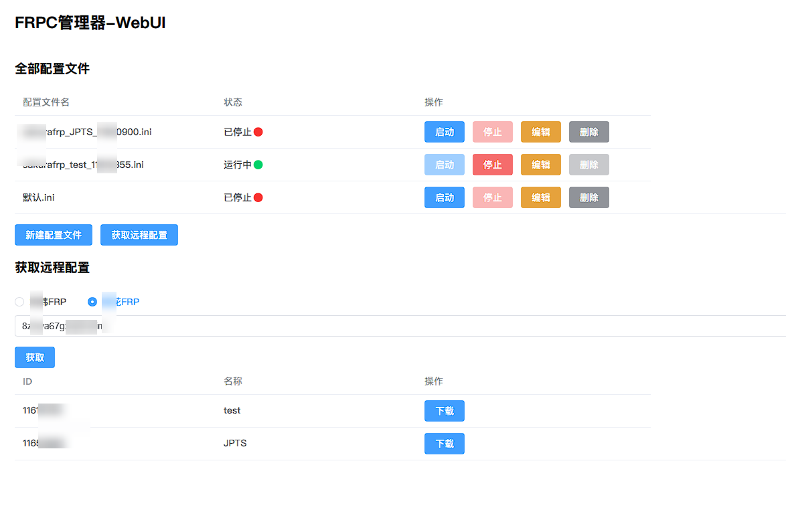

## FRPC 管理器

### 警告： WebUI面板无鉴权，请勿作死映射面板运行的端口到外网
### 依赖 ./frpc 目录下的本体和配置文件 本质是将frpc的启动命令可视化

### 这是我自己用的 代码烂的和狗屎一样。看不惯您随意。

### 当前分支 仅app.py为windows的webui和托盘程序。

### 打包exe命令  `pyinstaller FRPC-WebUI管理器.spec`

'